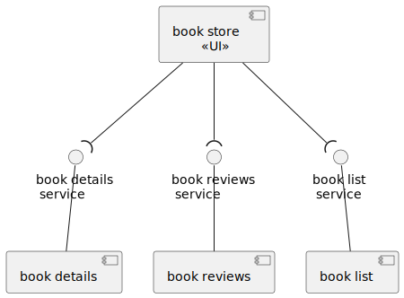

# Bookstore Application

This application is inspired by [istios bookinfo](https://istio.io/latest/docs/examples/bookinfo/) example app.
It is intended to demonstrate modern development practices such as microservices and containerization. The code accompanies a lecture held at TUM Heilbronn.

The main purpose of the application is to expose static information about books via a restful API.



# Part 1 - Build The API

To fulfill your part of the contract, make sure to at least implement a `RestController` with the following signature:

```
Request:
GET /books

Response:
Content-Type: application/json
Status Code: 200
Payload:
[
    { 
        "id": 1,
        "author": "Martin Kleppmann",
        "title": "Designing Data-Intensive Applications"
    },
    ...
]
```

The Endpoint will be consumed by the frontend application to render a list of available books.

# Part 2 - Create a Docker Image

The template repository comes with a ready to use [GitHub Workflow](../.github/workflows/build-push.yml) which consists
mainly of three steps:

1. `./gradlew bootJar`
2. `docker build .`
3. `docker push`

The workflow expects to find a `Dockerfile` on the root level of the books service. Your task is now to fill up the Dockerfile
with the needed instructions, so that is creating a Docker Image.

The following instructions might be of help.

* [FROM](https://docs.docker.com/engine/reference/builder/#from)
* [COPY](https://docs.docker.com/engine/reference/builder/#copy)
* [ENTRYPOINT](https://docs.docker.com/engine/reference/builder/#entrypoint)
* [EXPOSE](https://docs.docker.com/engine/reference/builder/#expose)

# Getting Started

Dependencies / build management is done with gradle. To build the self-contained `jar` artifact, all you need to do is:
```
./gradlew bootJar
```
The build output can then be found at `build/libs`.

To run the app locally, execute

```
./gradlew bootRun
```
If not specified otherwise, the embedded tomcat server will listen on port `8080`. Changing the default behavior can either be done by specifying a new port in `application.yml` or setting an environment variable called `PORT`.


### Reference Documentation
For further reference, please consider the following sections:

* [Official Gradle documentation](https://docs.gradle.org)
* [Spring Boot Gradle Plugin Reference Guide](https://docs.spring.io/spring-boot/docs/3.0.4/gradle-plugin/reference/html/)
* [Create a Docker image](https://spring.io/guides/topicals/spring-boot-docker/)
* [Spring Web](https://docs.spring.io/spring-boot/docs/3.0.4/reference/htmlsingle/#web)

### Guides
The following guides illustrate how to use some features concretely:

* [Building a RESTful Web Service](https://spring.io/guides/gs/rest-service/)
* [Serving Web Content with Spring MVC](https://spring.io/guides/gs/serving-web-content/)
* [Building REST services with Spring](https://spring.io/guides/tutorials/rest/)

### Additional Links
These additional references should also help you:

* [Gradle Build Scans – insights for your project's build](https://scans.gradle.com#gradle)

